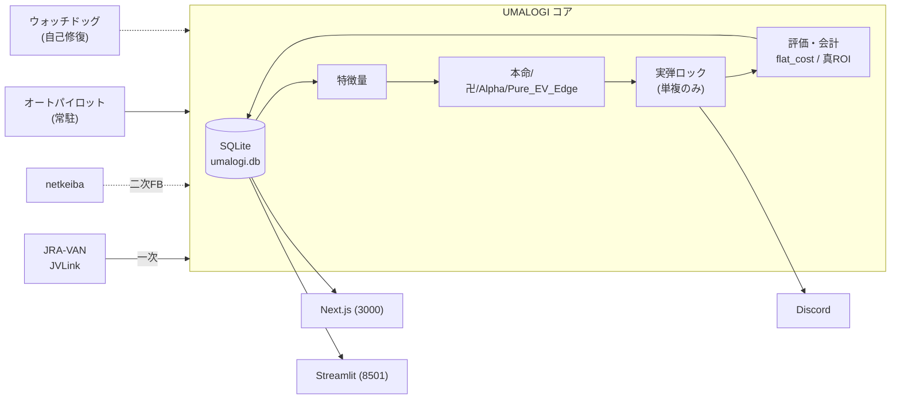

<div align="center">

# 🐎 UMALOGI

**自律型・競馬予測プラットフォーム**

JRA-VAN Data Lab. と netkeiba を統合し、LightGBM による全券種対応の AI が
期待値（EV）ベースで買い目を自動生成・照合・評価・再学習する、エンドツーエンドの無人運用システム。


-3776AB?logo=python&logoColor=white)


</div>

---

## 目次

- [システム概要](#システム概要)
- [ドキュメント体系](#ドキュメント体系)
- [アーキテクチャ](#アーキテクチャ)
- [2 つのフロントエンド](#2-つのフロントエンド)
- [ディレクトリ構造](#ディレクトリ構造)
- [本番運用（無人）](#本番運用無人)
- [環境構築](#環境構築)
- [運用コマンド一覧](#運用コマンド一覧)
- [テスト・品質](#テスト品質)
- [バージョン管理と貢献ルール](#バージョン管理と貢献ルール)
- [ライセンス](#ライセンス)

---

## システム概要

| 項目 | 内容 |
|---|---|
| データソース | JRA-VAN Data Lab. (JVLink COM) ＝ 一次 ／ netkeiba スクレイピング ＝ 二次フォールバック |
| 予測モデル | LightGBM 複数体制（本命 / 卍 / Alpha-Payout / Pure_EV_Edge）|
| 実弾ポリシー | **単勝・複勝のみにロック**（確定実績分析に基づく安全策）。三連系等は観賞用 |
| 検証ループ | W-057 シャドー A/B（Pure_EV_Edge vs 従来単複を確定 P&L で常時比較）|
| データ蓄積先 | SQLite `data/umalogi.db`（約 25 テーブル + ビュー）|
| ユーザー向け UI | **Next.js 15** `web/`（Port 3000）— 予想閲覧・当日購入ガイド |
| 運用者向け UI | **Streamlit** `web_streamlit/app.py`（Port 8501）— DB 直結の高速分析 |
| 通知 | Discord Webhook（5 チャンネル分離）/ note・X 集客導線 |
| 自動化基盤 | **オートパイロット常駐**（`today_auto_runner.py --continuous`）＋ 自己修復ウォッチドッグ |

> **設計の核**: 一次／二次の二段構えで「どちらが死んでも EV は算出される」ことを保証し、
> 実弾は単複に限定、会計は `flat_cost`（¥100×点数）で一本化、過去予測は不変（`is_superseded` 論理無効化）。

---

## ドキュメント体系

ドキュメントは役割別の 3 階層 ＋ 領域別 Changelog で構成される。

| ディレクトリ／ファイル | 役割 |
|---|---|
| 📖 [`docs/manual/`](docs/manual/) | **取扱説明書** — [利用者向け](docs/manual/USER_MANUAL.md) / [運用者向け](docs/manual/OPERATIONS_MANUAL.md) |
| 🛠️ [`docs/maintenance/`](docs/maintenance/) | **保守報告書** — [MAINTENANCE_LOG.md](docs/maintenance/MAINTENANCE_LOG.md)（全修正の横断タイムライン）|
| 📐 [`docs/spec/`](docs/spec/) | **仕様書（バージョン固定）** — [ARCHITECTURE_v1.0.0.md](docs/spec/ARCHITECTURE_v1.0.0.md) |
| 📄 [`docs/SYSTEM_ARCHITECTURE.md`](docs/SYSTEM_ARCHITECTURE.md) | 自動同期版アーキテクチャ（バージョン非固定）|
| 📚 `docs/1〜8_*.md` | 領域別仕様（予測ロジック / 自動化 / スキーマ / UI / ML ロードマップ / 特記事項 / 弱点台帳 / 商用）|
| 🤖 [`CLAUDE.md`](CLAUDE.md) | AI エージェント向け開発規約（運用条項・バージョン運用フロー・仕様書追従ポリシー）|

---

## アーキテクチャ



> 完全なデータフロー図・コンポーネント図・モジュールマップは
> **[仕様書 v1.0.0](docs/spec/ARCHITECTURE_v1.0.0.md)** を参照。

---

## 2 つのフロントエンド

```
┌─────────────────────────────────────────────────────┐
│                   UMALOGI Backend                    │
│   SQLite DB ← pipeline → models/ → predictions/      │
└───────────────┬─────────────────────┬────────────────┘
                │                     │
    ┌───────────▼──────────┐  ┌───────▼──────────────────┐
    │   Next.js (web/)     │  │  Streamlit (web_streamlit/)│
    │  ユーザー向け          │  │  運用者向け                │
    │  ・レース一覧・詳細    │  │  ・月次 ROI トレンド       │
    │  ・AI 予想スコア表示   │  │  ・ケリー資金曲線          │
    │  ・当日購入ガイド      │  │  ・会場別 ROI 分析         │
    │  ・的中結果履歴        │  │  ・バイアスパネル          │
    │  Port: 3000          │  │  Port: 8501               │
    └──────────────────────┘  └───────────────────────────┘
```

---

## ディレクトリ構造

```
UMALOGI/
├── VERSION                       # プロダクトバージョン（SemVer・単一真実源）
├── README.md                     # 本ファイル
├── CLAUDE.md                     # AI エージェント開発規約・運用条項
├── src/
│   ├── database/init_db.py       # DB 初期化・マイグレーション・CRUD ヘルパー
│   ├── scraper/                  # JVLink COM / netkeiba / RTD 取得
│   ├── ml/                       # 特徴量・モデル（本命/卍/Alpha/Pure_EV_Edge）・bet_policy・較正
│   ├── pipeline/                 # prediction（推論）/ scraping（取得段）
│   ├── evaluation/               # 的中評価（同着・返還対応・invested=flat_cost）
│   ├── notification/             # Discord ルーター（5ch）
│   └── ops/                      # health_reporter / retrain_trigger / jvlink_dialog_handler
├── scripts/
│   ├── today_auto_runner.py      # 【本番常駐】週次オートパイロット（--continuous）
│   ├── watchdog.py               # 【本番常駐】自己修復番犬（オッズ欠損監視）
│   ├── scheduler.py              # 週次スケジューラ（排他代替・現在不使用）
│   └── bat/                      # 無人運用バッチ（start/stop_umalogi.bat 他）
├── web/                          # Next.js 15 フロントエンド（ユーザー向け）
├── web_streamlit/app.py          # Streamlit ダッシュボード（運用者向け・正本）
├── tests/                        # pytest（1000+ ケース）
├── data/
│   ├── umalogi.db                # SQLite メイン DB
│   ├── models/                   # 訓練済みモデル (.pkl) + history/（10 世代）
│   └── backups/                  # 作業前バックアップ
├── docs/
│   ├── manual/                   # 取扱説明書（利用者/運用者）
│   ├── maintenance/              # 保守報告書（MAINTENANCE_LOG.md）
│   ├── spec/                     # バージョン固定仕様書（ARCHITECTURE_v*.md）
│   └── 1〜8_*.md                 # 領域別仕様
└── .claude/{skills,agents}/      # エージェント参照ドキュメント・Subagent 役割定義
```

---

## 本番運用（無人）

> ⚠️ **これが現在の真の稼働実態である。** `scheduler.py` は排他代替であり**本番では稼働していない**。
> オートパイロットと scheduler.py を**同時起動してはならない**（二重予想・二重通知・DB 汚染を招く）。

| プロセス | 起動コマンド | 役割 |
|---|---|---|
| **オートパイロット** | `py scripts/today_auto_runner.py --continuous` | 金曜夜の同期＋暫定予想 → 土日の直前予想/結果速報監視 → 日曜の週次レポート → 翌週まで自動スリープ |
| **ウォッチドッグ** | `py scripts/watchdog.py --interval 5` | オッズ欠損監視 → JVLink 再起動＋再同期を段階実行 |
| **ダッシュボード** | `py -m streamlit run web_streamlit/app.py --server.port 8501` | 成果可視化 Streamlit UI（正本）|

### ワンクリック起動・停止（Windows）

```bat
scripts\bat\start_umalogi.bat   :: 3 プロセスを別ウィンドウで非同期起動（二重起動ガード付き）
scripts\bat\stop_umalogi.bat    :: 該当スクリプト実行中の PID のみ安全停止
```

詳細は [`scripts/bat/README_BAT.md`](scripts/bat/README_BAT.md) と [運用者マニュアル](docs/manual/OPERATIONS_MANUAL.md) を参照。

---

## 環境構築

### 前提条件

- **Python 3.11+（既定 3.14・64bit）** — 通常処理用。JVLink COM 操作のみ内部で 32bit Python に委譲。
- **Node.js 20+** — Next.js フロントエンド用。
- **Windows 10/11** — JVLink は Windows COM サーバーのため。
- JRA-VAN Data Lab. 会員登録済み + JVLink インストール済み。
- 仮想環境（venv / Poetry）は**不使用**。システムの `py` ランチャーを使う。

### セットアップ

```bash
# 1. 依存ライブラリ
pip install -r requirements.txt

# 2. 環境変数（.env を作成）※ シークレットは絶対にハードコードしない
#   DISCORD_WEBHOOK_URL=https://discord.com/api/webhooks/...
#   JV_SDK_SID=...（JRA-VAN ソフトウェア ID）

# 3. DB 初期化（スキーマ作成・マイグレーション自動実行）
py -m src.database.init_db

# 4. フロントエンド（Next.js）
cd web && npm install && npm run build && npm start   # → http://localhost:3000
```

主要ライブラリ: `pandas≥2.2` / `numpy≥1.26` / `lightgbm≥4.3` / `scikit-learn≥1.4` /
`beautifulsoup4≥4.12` / `streamlit≥1.35` / `plotly≥5.22` / `playwright≥1.40`。

---

## 運用コマンド一覧

```bash
# 出馬表取得（金曜夜）
py -m src.main_pipeline friday [--date YYYYMMDD]

# 暫定予想 / 直前予想
py -m src.main_pipeline provisional
py scripts/run_prerace_auto.py [--date YYYYMMDD]

# 的中照合
py -m src.main_pipeline reconcile <race_id> [--dry-run]

# 再学習（旧モデルは history/ に 10 世代管理）
py -m src.main_pipeline train

# 年間バックテスト
py scripts/simulate_year.py --year 2024 [--venue 中山]

# JVLink データ取得（32bit 専用）
py -3-32 -m src.scraper.jravan_client --option 1
```

直前予想（prerace）の 6 ステップ処理フロー詳細は [予測ロジック仕様](docs/1_prediction_logic.md) を参照。

---

## テスト・品質

```bash
py -m pytest tests/ -q          # 全テスト（1000+ ケース）
ruff check .                    # 静的解析（変更ファイル限定で format も実施）
mypy src                        # 型チェック（リポジトリ全体 0 エラー）

cd web && npm test              # Next.js: Jest + React Testing Library
cd web && npm run type-check    # TypeScript 型チェック
```

- **型安全**: `from __future__ import annotations` ＋ `TYPE_CHECKING` で循環 import を避けつつ全体 mypy 0 エラー。
- **テスト独立性**: `conftest.py` で空 DB / `.env` 注入 / `journal_mode=DELETE` によりテストを完全独立化。
- **較正検証**: 時系列 out-of-sample で ECE=0.0177。

---

## バージョン管理と貢献ルール

本プロジェクトは [Semantic Versioning 2.0.0](https://semver.org/lang/ja/) に準拠し、
現行バージョンは [`VERSION`](VERSION) ファイルが単一真実源。

> **コミット必須 3 点セット**（[`CLAUDE.md`](CLAUDE.md) 条項6）
> コードを修正してコミットする際は、以下を**必ずセットで**実施する。1 つでも欠けたコミットは不可。
>
> 1. **`VERSION` の更新**（MAJOR: 互換破壊 / MINOR: 互換機能追加 / PATCH: 互換修正）
> 2. **[`docs/maintenance/MAINTENANCE_LOG.md`](docs/maintenance/MAINTENANCE_LOG.md) への追記**（修正者・修正日・バージョン・実施内容・影響範囲）
> 3. **[`docs/spec/`](docs/spec/) の該当バージョン仕様書の更新**（アーキテクチャ影響時）

> **仕様書追従ポリシー**（[`CLAUDE.md`](CLAUDE.md) 条項7）
> すべてのコード変更は、関連ドキュメントの加筆・修正と**不可分のセット**である。
> ドキュメントとコードの乖離は「技術的負債」ではなく「障害」として扱う。

コーディング規約（PEP8 / 型ヒント必須 / UTF-8 強制 / シークレットの環境変数化）は [`CLAUDE.md`](CLAUDE.md) を参照。

---

## ライセンス

**Private — All Rights Reserved.**
本リポジトリは個人運用の私的プロジェクトであり、OSS ライセンスでの公開はしていない。
収集データ（JRA-VAN / netkeiba / SNS 等）は各サービスの利用規約に従い、非公開 DB のみに格納する。
