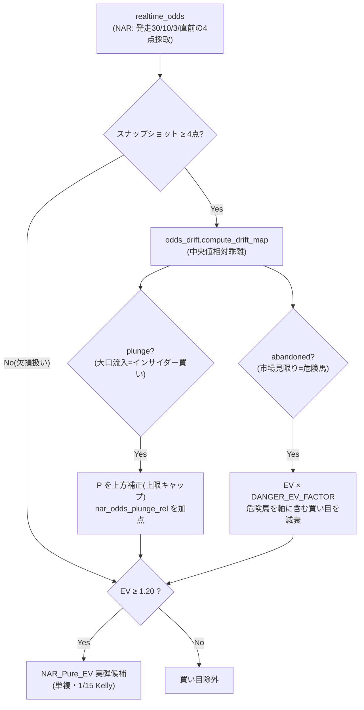

# UMALOGI 地方競馬（NAR）予想モデル 要件定義書

## 更新履歴（Changelog）

| 日付 | 変更内容 |
|------|---------|
| 2026-06-05 | 初版作成。完成済みデータ基盤層（Providerパターン）の上に乗せる NAR 予想モデル・EV ロジックの要件を定義。直前オッズ歪み（インサイダー投票）検知を最重要要件として明記。|

> 前提ドキュメント: データ取得層の設計は `docs/5_nar_integration_spec.md`、
> 実弾ポリシーの正典は `src/ml/bet_policy.py`、JRA のオッズ歪み検知実装は `src/ml/odds_drift.py`。
> 本書は「データ基盤の上にどんな予測モデル（EV ロジック）を乗せるか」の要件提案であり、実装前の仕様書である。

---

## 0. 位置づけと設計原則

NAR 統合は **共通コア（`src/ml/`）を一切変更せず、データ取得層のみ Provider で差し替える**
（`5_nar_integration_spec.md` §3）。本書はその上に乗せる**予測・EV・実弾ポリシー層**を定義する。

設計の最上位原則は JRA で確立した「**EV 精度最優先・破綻モデルの実弾稼働拒否**」を NAR でも貫くこと。

1. **EV 単一真実源**: NAR でも実弾判定は `bet_policy.is_live_bet()` 相当の単一関数に集約する。
2. **券種の単複限定**: 三連系・馬連・馬単・ワイドは控除率＋点数増で構造的に負けるため**実弾から除外**（JRA と同一）。
3. **較正なき確率を実弾に使わない**: 生のモデル確率ではなく Isotonic/Platt 較正済み確率で EV を算出する。
4. **観測期間を経るまで非実弾**: NAR は学習データが新規のため、初期は全モデルを `WATCH_ONLY`（予想生成・ROI 監視のみ・投票せず）から開始し、確定実績で黒字が確認されたモデルのみ実弾昇格する。

---

## 1. データ基盤層（完成前提・再掲）

`docs/5_nar_integration_spec.md` の Provider パターンにより、以下が DB に統一格納される前提:

- `races.datasource = 'nar'` で JRA と識別、`region`（south_kanto/hokkaido/tokai 等）・`grade`（A1/A2/B/C/D/重賞）。
- 出走表・**時系列オッズ（`realtime_odds` への複数スナップショット）**・確定結果・払戻。
- NAR 固有特徴量は `NARFeatureAdapter`（共通 FeatureBuilder の後処理アダプタ）で加算。

> ⚠️ 本予想モデルが成立する**必須条件**は「`realtime_odds` に 1 レースあたり最低 2 点（朝/暫定＋直前）の
> スナップショットが蓄積されること」。これが満たされないと §3 の歪み検知が死ぬ（JRA の `odds_snapshot_health` 同様の検証を NAR でも必須化する）。

---

## 2. NAR 予想モデルの提案（bet_policy.py を参考にした EV ロジック）

### 2.1 モデル構成（JRA の縮退構成を NAR へ移植）

JRA の確定実績は `LIVE_MODELS = {卍, Pure_EV_Edge, FukushoElite}` に縮退した。NAR でも同じ思想で
**EV 純粋追求の単複モデルを軸**に据える。提案する初期モデル:

| モデル名（提案） | 目的変数 | 券種 | 役割 |
|---|---|---|---|
| **`NAR_Pure_EV`** | ev_target（払戻/馬券代） | 単勝・複勝 | NAR 版 Pure_EV_Edge。較正済 P × オッズの EV フィルタ。黒字化の核。 |
| **`NAR_Fukusho`** | is_place（複勝圏） | 複勝 | NAR 版 FukushoElite。小頭数が多い NAR では複勝の的中安定性が高い。 |
| **`NAR_Honmei`（観測）** | is_win | 単勝・複勝 | 的中率モデル。初期は `WATCH_ONLY`（実績検証用）。 |

### 2.2 EV 算出ロジック（JRA と同一の数式・NAR 向け定数）

```
EV       = 較正済モデル確率 P × 推定払戻 / 100      （買い目基準 EV > 1.0）
真コスト = payout − profit                          （= ¥100 × 点数。会計の唯一の基準）
真ROI    = Σ payout / Σ 真コスト × 100 [%]
```

`pnl_accounting.compute_live_roi()` 相当を NAR にも適用し、`recommended_bet`（Kelly 実額）は会計に使わない（stake-independent 比較）。

### 2.3 NAR 向けのコードロック定数（`pure_ev_edge.py` を参考に NAR 用へ調整）

JRA の `pure_ev_edge.py` の定数を NAR の特性（小頭数・低オッズ・高インサイダー比率）に合わせて**より保守的**に設定することを提案する:

| パラメータ | JRA 値 | **NAR 提案値** | 根拠 |
|---|---|---|---|
| EV 閾値 | 1.15 | **1.20** | NAR はオッズ操作・インサイダー比率が高く推定誤差が大きい → 安全マージン増 |
| Kelly 比率 | 1/10 | **1/15** | データ蓄積前は更に保守的に。実績で黒字確認後に 1/10 へ緩和 |
| 単勝 Kelly cap | 0.02 | 0.015 | 同上 |
| 複勝 Kelly cap | 0.03 | 0.025 | 同上 |
| 確率フロア | 0.06 | **0.08** | 小頭数で有力馬に資金が偏るため、大穴の足切りを強める |
| 単勝オッズ上限 | 50.0 | **30.0** | NAR は出走頭数が少なく高オッズの的中信頼性が低い |
| 1レース最大点数 | 2 | 2 | 据え置き |
| 日次/週次損失上限 | 5% / 12% | 5% / 12% | サーキットブレーカーは据え置き（毎日開催のため日次は厳守） |

### 2.4 実弾昇格フロー（破綻モデルの実弾稼働拒否）

JRA の A/B 昇格基準（`AB_MIN_RACES=100`・ROI 差 +10pt）を NAR にも適用:

```
全モデル WATCH_ONLY で開始
  → 確定実績 100R 以上を消化
    → 真ROI ≥ 100%（黒字）を確認
      → LIVE_MODELS へ昇格（is_live_bet=True）
不調転落（真ROI < 100% が継続）→ 即 WATCH_ONLY へ退避（JRA の本命/Alpha-Payout と同じ扱い）
```

---

## 3. 【最重要要件】直前オッズの歪み（インサイダー投票）の捕捉

### 3.1 なぜ NAR で最重要か

地方競馬は中央（JRA）に比べ**市場規模が小さく、関係者・常連の直前大口投票がオッズを大きく動かす**。
この「直前オッズの歪み」は、公開情報に現れない**馬の状態・厩舎の勝負度合い（インサイダー情報）**の代理シグナルとして極めて価値が高い。NAR モデルの EV エッジの中核に据える。

### 3.2 既存基盤の流用（`src/ml/odds_drift.py`）

JRA 向けに実装済みの `odds_drift.py` がそのまま基盤になる。これは
`realtime_odds` の最古スナップショット（baseline=朝/暫定）と最新（直前）を馬番単位で比較し、
**レース中央値からの相対乖離**で以下を検知する（全馬の系統シフトを中央値が吸収し誤検知を防ぐ）:

- **急落（plunge / 大口流入）**: 中央値比で突出して下落 = 資金集中 = インサイダーの買い。**EV 加点候補**。
- **急騰（abandoned / 市場見限り）**: 中央値比で突出して上昇 = 危険馬。**EV 減衰**（`DANGER_EV_FACTOR=0.5`）。

### 3.3 NAR 向けに追加・調整すべき要件

`odds_drift.py` を NAR で活かすための具体要件:

1. **スナップショット採取の高頻度化**
   発走直前の急変を捉えるため、NAR では発走 **30分前・10分前・3分前・直前** の最低 4 点採取を必須とする
   （`MIN_HEALTHY_SNAPSHOTS` を NAR では 4 へ引き上げ）。採取ソースは SPAT4/楽天競馬/オッズパークのオッズページ（`5_nar_integration_spec.md` §8.3）。

2. **しきい値の NAR チューニング**
   市場が小さくボラティリティが高いため、JRA の `PLUNGE_THRESHOLD=0.25` / `ABANDON_THRESHOLD=0.40` を
   NAR では**やや緩め**（例 0.30 / 0.45）に再較正し、ノイズと真のインサイダー流入を分離する。場別（南関東 vs 地方単独場）に係数を持つことを推奨。

3. **plunge を「EV 加点」へ昇華（JRA は減衰のみ）**
   JRA 実装は急騰馬の減衰が主目的だが、NAR では **急落馬（大口流入）に対する EV 加点**を新要件として追加する。
   - 加点は**較正済確率の補正**として実装（生の EV を直接膨らませない）。例: plunge 検知馬は P を `× (1 + α·rel_drift)` で補正（α は実績で調整、上限キャップ必須）。
   - ただし**インサイダーの裏（見せ金・撹乱）リスク**があるため、加点は EV 閾値 1.20 を満たす範囲に限定し、過信を防ぐ。

4. **インサイダー・シグナルの特徴量化**
   `NARFeatureAdapter.NAR_FEATURE_COLS` に以下を追加することを提案:
   - `nar_odds_plunge_rel`（直前の相対急落率）
   - `nar_odds_abandon_rel`（直前の相対急騰率）
   - `nar_late_money_concentration`（直前スナップショット間の資金集中度＝オッズ分散の縮小率）

5. **健全性の構造的検証**
   JRA の `jravan_pipeline.odds_snapshot_health` と同等の検証を NAR でも必須化し、
   スナップショットが 4 点未満のレースは**歪み特徴量を欠損扱い**にして EV 加点を無効化（取得失敗を「歪みなし」と誤認しない）。

### 3.4 歪み検知の処理フロー（Mermaid）



---

## 4. 実装フェーズ（要件 → 実装の橋渡し）

| フェーズ | 内容 | 依存 |
|---|---|---|
| **M-0** | 本要件確定・`bet_policy` の NAR 版定数を `nar_bet_policy.py`（仮）に定義 | `5_nar_integration_spec.md` のスキーマ拡張完了 |
| **M-1** | `realtime_odds` への NAR 高頻度スナップショット採取（SPAT4/楽天/オッズパーク） | Provider 実装 |
| **M-2** | `odds_drift.py` の NAR しきい値・場別係数の再較正 + plunge 加点ロジック | M-1 |
| **M-3** | `NARFeatureAdapter` に歪み特徴量追加 → `NAR_Pure_EV`/`NAR_Fukusho` 訓練 | M-2 |
| **M-4** | 全モデル `WATCH_ONLY` で平日無人運用開始 → 100R 消化後に実弾昇格判定 | M-3 |

---

## 5. リスクと禁則（JRA 規範の継承）

- **過去レコード不変性**（条項1）: NAR `predictions` も race_id ごと INSERT のみ。UPDATE/DELETE 禁止。
- **作業前バックアップ**（条項4）: スキーマ変更・モデル訓練前に必ずバックアップ。
- **インサイダー加点の過信禁止**: 直前歪みは強力だが「裏」がある。EV 閾値・確率キャップ・サーキットブレーカーの三重防御を外さない。
- **稼働中 JRA への非干渉**: NAR は別 datasource・別常駐ループ（`5_nar_integration_spec.md` §6・§9-4）。JRA の実弾・会計に一切混入させない。

---

> 本書は実装前の要件定義であり、コード変更を伴わない。
> CLAUDE.md 条項7（Documentation-Follows-Code）に基づき、実装着手時に本書と各実装ファイルの整合を取ること。
