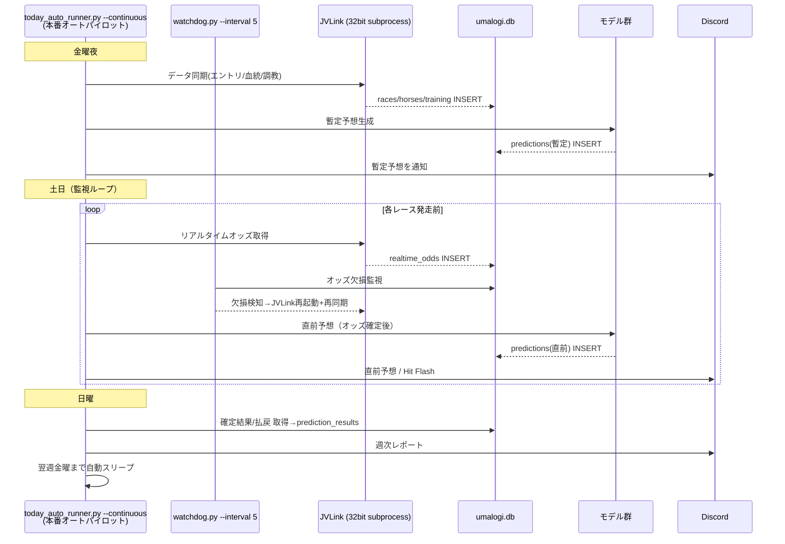
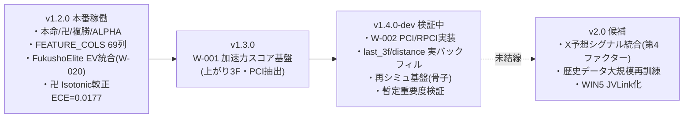

# UMALOGI システムアーキテクチャ 最終版（逆生成）

> 生成日: 2026-06-02 ／ VERSION: `1.4.0-dev`（本番稼働は `v1.2.0` 系）
> 作成: Claude（マックスプラン最終資産化タスク）
> 本書はリポジトリ構造・特徴量ロジック・本番常駐構成を解析して逆生成したもの。
> 矛盾時は CLAUDE.md「本番稼働アーキテクチャ」ブロックを正典とする。

---

## 1. データフロー全体図（Mermaid）

```mermaid
flowchart TD
    subgraph SRC["データソース（二段構え）"]
        JV["JRA-VAN / JVLink<br/>(一次・32bit COM)"]
        NK["netkeiba<br/>(二次・フォールバック)"]
        XS["X（Twitter）<br/>凄腕予想家シグナル(計画)"]
    end

    subgraph INGEST["取得層 src/scraper/"]
        JC["jravan_client.py"]
        RTD["rtd_reader.py<br/>(確定結果/払戻)"]
        ET["entry_table.py<br/>(エントリ/オッズ)"]
        XSC["x_scraper.py(計画)"]
    end

    subgraph DB["SQLite: data/umalogi.db"]
        T1["races / race_results"]
        T2["race_payouts / realtime_odds"]
        T3["horses / racehorses / jockeys / trainers"]
        T4["training_times / training_hillwork"]
        VM["v_race_mart<br/>(63列フラットビュー・全結合)"]
        PRED["predictions / prediction_results"]
    end

    subgraph FEAT["特徴量エンジニアリング src/features・src/ml"]
        FB["features.py<br/>FEATURE_COLS = 69列"]
        US["u_score.py<br/>(18因子 U-Score)"]
        ACC["acceleration.py<br/>(W-001 加速力・上がり3F)"]
        PCI["backtest_v2.py<br/>(W-002 PCI/RPCI・v1.4.0-dev)"]
        EVF["ev_features.py<br/>(Shin/Harville/Kelly)"]
        XSP["x_signal_parser.py<br/>(X consensus・計画)"]
    end

    subgraph MODEL["モデル層 src/ml/"]
        HON["本命モデル honmei<br/>(is_win・的中率特化)"]
        MAN["卍モデル manji<br/>(ev_target・回収率特化)<br/>★唯一の黒字頭"]
        PLC["複勝/FukushoElite<br/>alpha_place_model.py"]
        ALP["ALPHA / Alpha-Payout<br/>alpha_model.py"]
        PEE["Pure_EV_Edge<br/>pure_ev_edge.py<br/>★黒字化専用"]
        CAL["calibration.py / manji_calibration.py<br/>(Isotonic・ECE=0.0177)"]
    end

    subgraph DECIDE["買い目生成 src/ml/"]
        BG["bet_generator.py<br/>EV = P × 払戻/100, EV>1.0"]
        BP["bet_policy.py<br/>(Kelly分割/MAX_BET/CB)"]
        PNL["pnl_accounting.py<br/>(真の損益・返還/同着対応)"]
    end

    subgraph OUT["出力層 src/notification・web"]
        DISC["Discord 通知 / Hit Flash"]
        NOTE["note 記事 / SNS コピー"]
        WEB["Next.js ダッシュボード web/"]
        STR["Streamlit web_streamlit/app.py<br/>(成果可視化・正本)"]
    end

    JV --> JC --> DB
    JV --> RTD --> DB
    NK --> ET --> DB
    XS -.計画.-> XSC -.-> DB

    T1 & T2 & T3 & T4 --> VM
    VM --> FB
    FB --> US & ACC & EVF
    ACC -.v1.4.0-dev.-> PCI
    XSP -.計画.-> FB

    FB --> HON & MAN & PLC & ALP & PEE
    CAL --> MAN
    CAL --> PLC

    HON & MAN & PLC & ALP & PEE --> BG
    BG --> BP --> PNL
    PNL --> PRED

    PRED --> DISC & NOTE & WEB & STR
```

---

## 2. 推論パイプライン（時系列ループ・Mermaid）



> ⚠️ `predictions` は **race_id ごとの INSERT のみ許可**（CLAUDE.md 条項1）。
> 過去レコードの UPDATE/DELETE・再生成上書きは禁止。

---

## 3. 本番常駐プロセス（実態）

| プロセス | 起動コマンド | 役割 |
|---|---|---|
| オートパイロット | `py scripts/today_auto_runner.py --continuous` | 週次自律運転の中核 |
| ウォッチドッグ | `py scripts/watchdog.py --interval 5` | オッズ欠損の自己修復 |
| ダッシュボード | `py -m streamlit run web_streamlit/app.py --server.port 8501` | 成果可視化（正本） |

- ワンクリック起動/停止: `scripts/bat/start_umalogi.bat` / `stop_umalogi.bat`
- `scripts/scheduler.py` は**不使用の排他代替**（オートパイロットと同時起動禁止）。

---

## 4. 主要モジュール対応表

| 層 | ディレクトリ | 主要ファイル |
|---|---|---|
| 取得 | `src/scraper/` | jravan_client / rtd_reader / entry_table / update_payouts |
| DB | `src/database/` | init_db.py（DDL/マイグレーション） |
| 特徴量 | `src/features/`・`src/ml/` | features(69列) / u_score / acceleration / ev_features |
| モデル | `src/ml/` | models / alpha_model / alpha_place_model / pure_ev_edge / calibration |
| 買い目 | `src/ml/` | bet_generator / bet_policy / pnl_accounting |
| パイプライン | `src/pipeline/` | prediction / scraping / training / simulation / anomaly |
| 通知 | `src/notification/` | Discord / note / SNS |
| 運用 | `src/ops/`・`scripts/` | jvlink_dialog_handler / today_auto_runner / watchdog |

---

## 5. ロードマップ：v1.2.0（稼働中）→ v1.4.0-dev（検証中）



### 稼働中 v1.2.0 と 検証中 v1.4.0-dev の差異

| 項目 | v1.2.0（本番） | v1.4.0-dev（検証） |
|---|---|---|
| FEATURE_COLS | 69列（確定・本番結線） | 69列**不変**（PCI/加速力は非破壊で連結検証段階） |
| 加速力スコア(W-001) | 未結線 | `acceleration.py` 実装・上がり3F抽出 |
| PCI/RPCI(W-002) | 無し | `backtest_v2.py` で算出（**本番学習に未結線・骨子**） |
| last_3f データ | 部分 | 実バックフィル進行中（`bulk_backfill_features`） |
| 再シミュ | 無し | `run_backtest_v2.py`（学習データ生成検証モック） |
| 黒字化戦略 | 卍が唯一黒字 | Pure_EV_Edge 統合で137〜211%(BT)を狙う |

### v1.4.0 完成の残タスク
1. PCI/加速力の **FEATURE_COLS 正式統合 → 全モデル再訓練**（現状は非破壊連結検証のみ）
2. `bulk_backfill_features` 完走後の last_3f カバレッジ確認（2024-07/08 結果ゼロ問題の解消）
3. Pure_EV_Edge の本番配信ルート結線（過剰露出の抑制・露出集約）
4. X予想シグナル（`x_scraper`/`x_signal_parser`）の本番配線（現状 x_signals 0件・未配線）

---

> 本書は読取専用解析に基づく。コード変更は伴わない。
> CLAUDE.md 条項3・条項7（Documentation-Follows-Code）に基づきドキュメント整合を担保。
