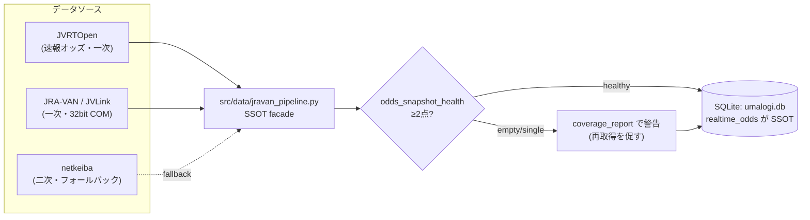
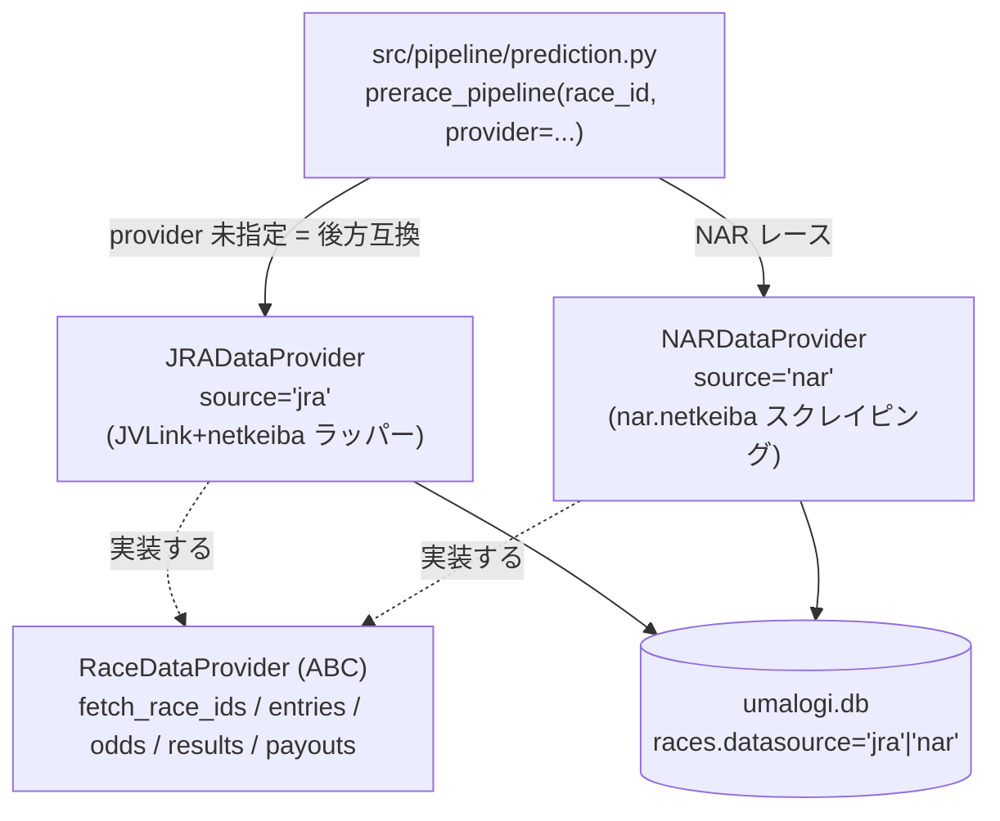
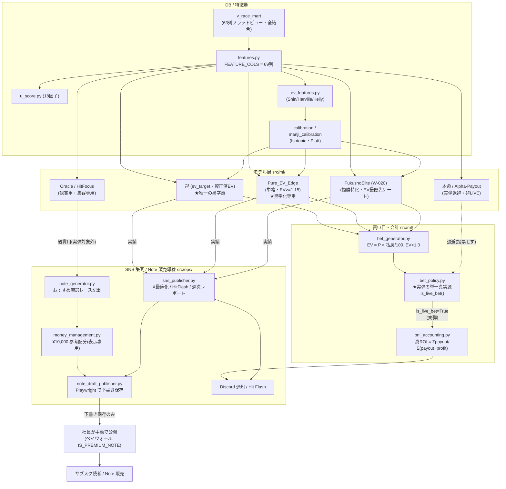
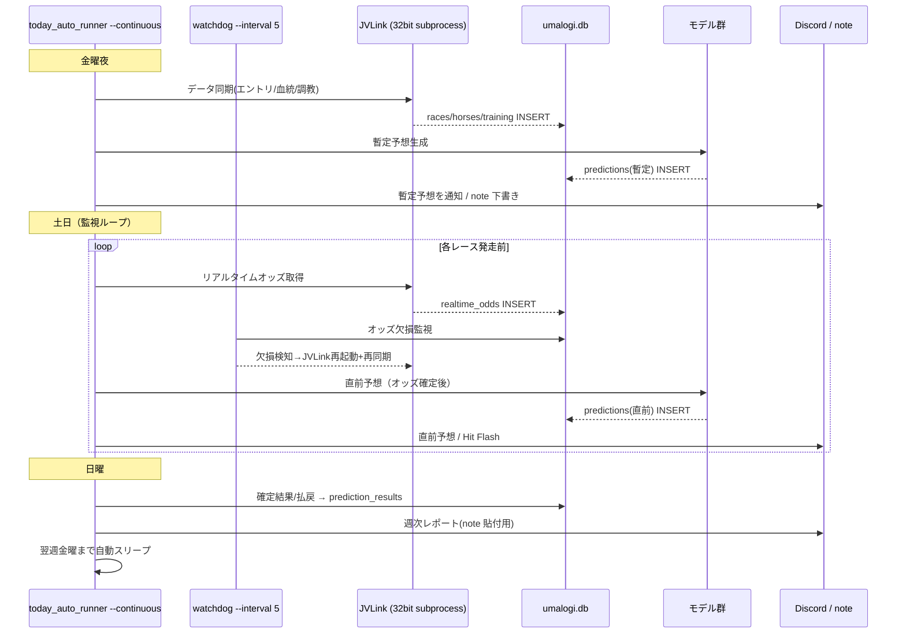
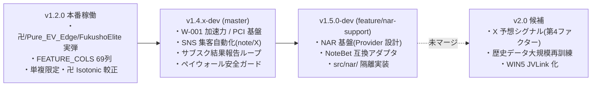

# UMALOGI システムアーキテクチャ 最終資産化版（逆コンパイル）

> 生成日: 2026-06-04 ／ master VERSION: `1.4.3-dev`（本番稼働は `v1.2.0` 系の実弾構成）
> 作成: Claude（マックスプラン終了に向けた完全資産化タスク）
> 本書はリポジトリ（master ブランチ）のコードを走査して逆生成した「現状の真実」である。
> 矛盾時は CLAUDE.md「本番稼働アーキテクチャ」ブロックを正典とする。
> 投資戦略・引き継ぎ事項は `docs/PROJECT_HANDOVER.md` を参照。

---

## 0. このドキュメントの読み方

UMALOGI は JRA-VAN データを核に、LightGBM 予測エンジン・期待値(EV)ベース買い目生成・
SNS 集客（Note 販売導線）・ダッシュボードを統合したエンドツーエンドの自律型競馬予測プラットフォームである。

本書は以下の3層で構成される。

1. **データ取得・分岐パイプライン**（JRA-VAN/netkeiba、および NAR の Provider パターン）
2. **EV 算出 → 実弾投票 → SNS 集客（Note 販売導線）までの全体データフロー**
3. **主要 DB スキーマ**（JRA 現行 + NAR 拡張設計）

---

## 1. データ取得・分岐パイプライン（RaceDataProvider）

### 1.1 現状（master）: JRA-VAN 一次・netkeiba 二次の二段構え

master の本番経路は JRA 専用で、`src/data/jravan_pipeline.py` が
**JRA-VAN データの単一真実源(SSOT) facade** として機能する。新しい取得ロジックを
再実装せず、検証済みの既存実装へ委譲する設計。

| データ種別 | 一次ソース | 二次（フォールバック） | SSOT |
|---|---|---|---|
| リアルタイム/時系列オッズ | JRA-VAN 速報 `JVRTOpen` → RTD | netkeiba スクレイピング | `realtime_odds` テーブル（W-055 で統一） |
| 直前情報（馬体重・天候馬場） | JVLink | netkeiba | — |
| エントリー | JVLink (`jravan_client.py`) | netkeiba (`entry_table.py`) | `races` / `entries` |
| 確定結果・払戻 | JVLink RTD (`rtd_reader.py`) | netkeiba (`update_payouts.py`) | `race_results` / `race_payouts` |

> **オッズ三段フォールバック**: `src.pipeline.scraping.fetch_and_save_odds` が
> `JVRTOpen → RTD → netkeiba` の順で取得。`jravan_pipeline.py` は取得「後」に
> `odds_snapshot_health` で時系列スナップショット点数を検証し（最低 `MIN_HEALTHY_SNAPSHOTS=2`）、
> `coverage_report` で「2点以上=健全 / 1点 / 0点」をレース横断で可視化。
> 「取得したつもりで空のまま進む」事故（odds_drift/odds_momentum の死）を構造的に検知する。



### 1.2 将来（NAR 統合）: Provider パターンによる分岐

地方競馬（NAR・年365日・全国16場・JRA の 3〜5倍のレース機会）への拡張は、
**共通コア（`src/ml/`）を一切変更せず、データ取得層のみ差し替える Provider パターン**で行う。
設計の正典は `docs/5_nar_integration_spec.md`。

> ⚠️ **実装状態（重要・誤認防止）**:
> master ブランチには `RaceDataProvider` 抽象・`jra_provider.py` / `nar_provider.py` は
> **まだ存在しない**（`src/nar/` は master では空）。NAR 基盤は別ブランチ
> `feature/nar-support`（v1.5.0-dev）に隔離実装済み（`src/nar/`・NoteBet 互換アダプタ・15テスト PASS）。
> master の `src/ml/` 各所に現れる "nar" 文字列は "narrative"（根拠文生成）の部分一致であり NAR ではない。



- 分岐キーは `races.datasource`（`'jra'` / `'nar'`）。`race_id` 形式が JRA(`YYYYKKNNVVRR`)と NAR で異なるため、識別はカラムで行う。
- NAR は JVLink COM（32bit 専用）を使わず 64bit で直接スクレイピング可能 → 32bit/64bit 分離が不要でスケジューラが単純化する。
- 共通コア（`features.py` / `models.py` / `bet_generator.py` / `ev_features.py` / `u_score.py`）は変更禁止。NAR 固有特徴量は `NARFeatureAdapter`（後処理アダプタ）で加算。

---

## 2. EV 算出 → 実弾投票 → SNS 集客（Note 販売導線）の全体データフロー



### 2.1 フローの要点

1. **EV 算出**: `bet_generator` が `EV = P(モデル確率) × 推定払戻 / 100` を計算し、`EV > 1.0` を買い目基準とする。卍/Pure_EV_Edge/FukushoElite は Isotonic/Platt 較正済み確率を用いる。
2. **実弾判定**: `bet_policy.is_live_bet(model, bet_type)` が「実際に投票するか」の唯一の定義。実弾は **単勝・複勝のみ**、実弾モデルは **卍 / Pure_EV_Edge / FukushoElite** に集約。
3. **会計**: `pnl_accounting.compute_live_roi()` が `真コスト = payout − profit`（= ¥100×点数）基準で真 ROI を集計。Kelly 実発注額（`recommended_bet`）はコスト基準に使わない（stake-independent な比較を保証）。
4. **集客（Note 販売導線）**: 観賞用モデル（Oracle/HitFocus）の買い目と実弾モデルの実績を、`note_generator`（記事）→ `money_management`（¥10,000 参考配分の表示）→ `note_draft_publisher`（Playwright で**下書き保存のみ**）の順で整形。公開（発行）とペイウォール（`IS_PREMIUM_NOTE`）の最終操作は社長が手動で行う。`sns_publisher` は X 投稿最適化・HitFlash（高 ROI/万馬券のみ発火）・週次レポートを担当。

---

## 3. 本番常駐プロセス（実態）

| プロセス | 起動コマンド | 役割 |
|---|---|---|
| オートパイロット | `py scripts/today_auto_runner.py --continuous` | 週次自律運転の中核 |
| ウォッチドッグ | `py scripts/watchdog.py --interval 5` | オッズ欠損の自己修復（JVLink 再起動＋再同期） |
| ダッシュボード | `py -m streamlit run web_streamlit/app.py --server.port 8501` | 成果可視化（正本は `web_streamlit/app.py` 唯一） |

- ワンクリック起動/停止: `scripts/bat/start_umalogi.bat` / `stop_umalogi.bat`（二重起動ガード／スクリプト名一致 PID のみ安全停止）。
- `scripts/scheduler.py` は**不使用の排他代替**。`today_auto_runner --continuous` と同時起動禁止（二重予想・二重通知・`predictions` 汚染を招く）。
- JVLink ダイアログは `src/ops/jvlink_dialog_handler.py` が daemon スレッドで 0.3 秒間隔に自動突破（三重安全網）。

### 3.1 週次自律運転シーケンス



> ⚠️ `predictions` は **race_id ごとの INSERT のみ許可**（CLAUDE.md 条項1）。
> 過去レコードの UPDATE/DELETE・再生成上書きは禁止（Discord 通知済み予想と DB の乖離防止）。

---

## 4. 主要 DB スキーマ

### 4.1 JRA 現行（master 稼働中）

接続は `src/database/init_db.py` の `init_db()` 経由（SQLite `data/umalogi.db`、`PRAGMA foreign_keys = ON`）。

| テーブル | 説明 |
|---|---|
| `races` | レース基本情報 |
| `race_results` | 出走・着順結果（同着＝rank 複数同値、競走中止＝rank IS NULL/0） |
| `race_payouts` | 確定払戻（返還＝`bet_type='返還'` で対象馬番含む買い目は 100 円返還） |
| `realtime_odds` | オッズ SSOT（リアルタイム＋時系列スナップショット） |
| `horses` | 馬マスタ（血統 sire/dam/dam_sire） |
| `racehorses` / `jockeys` / `trainers` / `breeding_horses` | 各マスタ |
| `training_times` / `training_hillwork` | 調教タイム・坂路調教 |
| `v_race_mart` | AI 学習用フラットビュー（63列・全テーブル結合済） |
| `predictions` | 予想バッチ（`model_type`・`bet_type`・`recommended_bet`・`is_superseded`） |
| `prediction_results` | 的中・払戻実績（`payout`・`profit`・`is_hit`） |

### 4.2 NAR 拡張（`feature/nar-support` 設計・未マージ）

`docs/5_nar_integration_spec.md` に基づくスキーマ拡張（`init_db.py` の `_migrate_nar_support()` として追加予定）:

```sql
-- races テーブル拡張
ALTER TABLE races ADD COLUMN datasource TEXT NOT NULL DEFAULT 'jra';  -- 'jra' | 'nar'
ALTER TABLE races ADD COLUMN region TEXT;   -- 'central' | 'south_kanto' | 'hokkaido' | 'tokai' ...
ALTER TABLE races ADD COLUMN grade  TEXT;   -- JRA:'G1'.. / NAR:'A1'/'A2'/'B'/'C'/'D'/'重賞'

CREATE INDEX IF NOT EXISTS idx_races_datasource_date ON races (datasource, date);
```

NAR 固有特徴量（`NARFeatureAdapter.NAR_FEATURE_COLS`、JRA 69列に加算して約74列）:
`nar_jockey_win_rate` / `nar_horse_distance_win_rate` / `nar_grade_rank` / `nar_field_size_ratio` / `nar_days_since_last_run`。

---

## 5. ロードマップ：v1.2.0（稼働中）→ v1.4.3-dev（master）→ v1.5.0（NAR）



詳細な投資戦略・残タスク（Next Steps）は **`docs/PROJECT_HANDOVER.md`** を参照。

---

> 本書は読取専用解析に基づく逆コンパイル文書である（コード変更を伴わない）。
> CLAUDE.md 条項3・条項7（Documentation-Follows-Code）に基づきドキュメント整合を担保。
