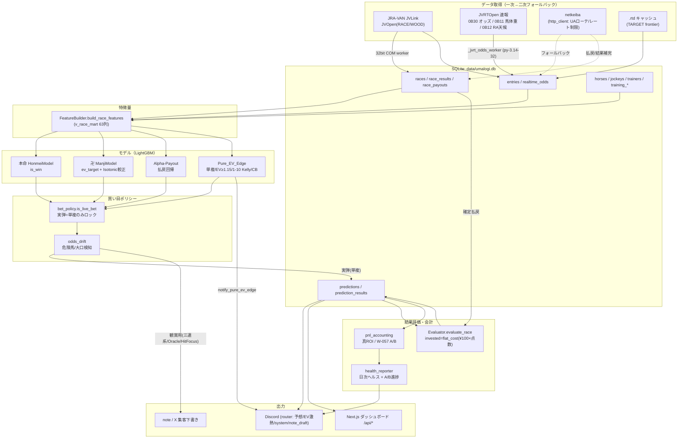
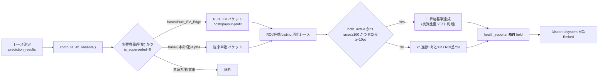
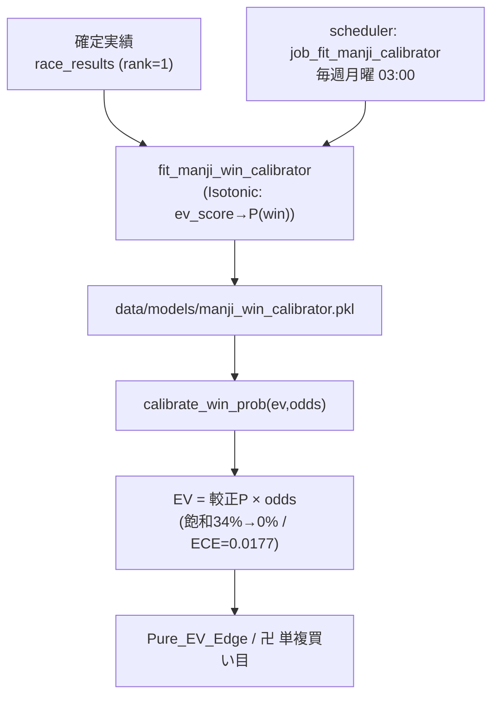

# UMALOGI システムアーキテクチャ仕様書

> 本書は最新ソースコード（Pure_EV_Edge 完全配線 / W-057 シャドーA/B / W-058 日次ヘルスレポート /
> 卍 Isotonic 較正 / 単複限定ロック / 会計二重性分離 / コア層の型安全化基盤 が統合された状態）を
> 解析して自動生成・同期したものである。データフロー・検証ループを Mermaid 図で示す。
>
> 最終同期: 2026-06-01 / 対象ブランチ: grandslam/typesafety（隔離worktree・master へ FF 予定）

## 更新履歴

| 日付 | 変更内容 |
|------|----------|
| 2026-06-11 | UI/UX 超絶強化（v1.13.0-dev）: ①`src/ui/console.py` 新設（UmaConsole=rich製コックピットCUI: バナーPanel/グラデーションプログレス/高EVシグナル金色Panel/候補テーブル。rich未導入・cp932・非TTYは plain 縮退）＋`setup_logging(use_rich=True)` の RichHandler オプション（ファイルログ書式不変）。today_auto_runner/premium_pack に配線。②`src/notification/embed_builder.py` 新設＋`notify_prerace_result` 統合（格付けG1青/G2赤/G3緑・自信度グラデーション・万馬券EV優先の動的Embedカラー、軸/相手/EVの3カラムグリッド、`████░░░░░░ 40%` 投資比率バー=UMALOGI_BANKROLL連動。race_name を prediction→router→notifier に貫通）。③`premium_pack.generate_premium_html`（Tailwind CDN・漆黒×シャンパンゴールドの自己完結HTML）を premium_sanren.md と並列出力。rich を requirements に追加。1442テストPASS・mypy 0・実弾ポリシー/スキーマ/モデル不変。詳細: docs/ui_ux_upgrade_report.md |
| 2026-06-11 | 過去モデル昇華アンサンブル（v1.12.0-dev）: `src/ml/legacy_ensemble.py` 新設。全過去pkl資産のOOS静的解析で採用した卍(EV回帰)の暗黙勝率を honmei に w=0.4 融合（三連複限定・w=0恒等設計・失敗時フォールバック）。`premium_pack` の三連複抽出が `ManjiScoreSource`（卍pkl＋FeatureBuilder全頭推論）経由のアンサンブル確率を使用し週末オートパイロットから自動有効。OOS 400R 合計ROI 110.0%→119.2%（三連複106.9%→157.9%・最大1的中除外81.8%→107.8%）。ALPHA系(市場複製)/cascade(stage1欠落)/sandbox/v2系/pre69feat(精度不足)は不採用。実弾ポリシー（単複ロック）不変 |
| 2026-06-11 | 収益化自動運用＋堅牢化（v1.11.0-dev）: ①`src/marketing/premium_pack.py` 新設（本命予想→blend_with_market→割引Harville→三連系EV1.30超フォーメーション＋Leak Storyチラ見せ）を `today_auto_runner._run_one_day` へ best-effort 配線（週末朝に outputs/marketing/ 自動生成）。②`bankroll_manager` にポートフォリオ破産MC（`simulate_portfolio_ruin`/`recommend_portfolio_stakes`・P(破産)≤1%制約の最適Kelly分数）。③スクレイパー堅牢化4件（RTD TOCTOU/ファイル名検証/オッズAPI形状ガード/日付正規化）。実弾ポリシー（単複ロック）・モデルは非接触 |
| 2026-06-11 | 完全体アップグレード（v1.9.0-dev）: ①全券種EVエンジン `src/ml/all_ticket_optimizer.py`（割引Harville着順分布→全券種EV歪み抽出→フォーメーション。**未結線**＝実弾単複ロック不変・分析/サブスク用）②見送り判定 `src/ml/no_bet_filter.py`（レース単位chaos_score二値ゲート・W-079で段階導入）③AccuracyModelV2/ハイブリッドアンサンブル検証を accuracy-model worktree から master へ移植（orphanテスト解消・honmei 69列整列バグ修正）。詳細: docs/fable_ultimate_upgrade.md |
| 2026-06-11 | ビジネスシステム化レイヤー追加（v1.8.0-dev）: ①金融工学レイヤー `src/ml/bankroll_manager.py`（同時ベット縮約Kelly・動的バンクロール・MC破産確率・ドローダウンスロットル。**本番未結線**＝OOSゲート後にW-078で結線判断）②マーケティングレイヤー `src/marketing/sns_generator.py`（盾と矛戦略の無料予想/実弾限定の的中実績/動画台本＋サブスク導線キラーフレーズの日次自動生成）③自動運用の宣言的SSoT `config/automation_daily.yaml`＋タスクスケジューラ登録 `scripts/bat/register_daily_tasks.ps1`（UMALOGI_BootStart/UMALOGI_DailyMarketing）。全体設計: docs/business_architecture_fable.md。影響: src/ml/bankroll_manager.py, src/marketing/, config/, scripts/bat/ |
| 2026-06-01 | 予防監視を追加（v1.1.0・W-064/W-065）: `health_reporter` に実弾モデル別の直前生成件数(distinct race)監視を追加し、開催日に生成0件のモデルがあれば日次ヘルスを warn 昇格＋Discord 通知（Pure_EV_Edge=0 等のサイレント障害を自動検知）。`today_auto_runner` の金曜夜/土曜夜バッチに `x_scraper` 収集を subprocess 配線（収集0件/失敗時は明示アラート・`X_SCRAPER_DISABLED=1` で無効化可）。影響: src/ops/health_reporter.py, scripts/today_auto_runner.py |
| 2026-06-01 | グランドスラム総点検: コア層(prediction/bet_generator/umanity_uploader/alpha_payout/place)の mypy エラーを 142→71 に半減（型契約の正名化＋_run_alpha_payout の return None 実バグ修正）。P&L 集計の COVERING INDEX 選択を ANALYZE で実現（§8 追記）。型契約回帰テスト23件追加（§9）。影響: src/pipeline/prediction.py, src/ml/bet_generator.py, src/ops/umanity_uploader.py, src/ml/alpha_*_model.py, src/database/init_db.py |

---

## 1. 概要

UMALOGI は JRA-VAN（JVLink）データを一次ソースとする自律型・競馬予測プラットフォーム。
LightGBM ベースの複数モデルが予測を出し、**実弾は単勝・複勝のみにロック**（確定実績分析に基づく）、
Pure_EV_Edge（黒字化専用枠）と従来モデルを **W-057 シャドーA/B** で常時比較しながら、
Discord 通知・Web ダッシュボード・note/X 集客導線へ出力する。

### 設計原則
- **一次/二次の二段構え**: JVLink（公式）→ netkeiba（フォールバック）。どちらが死んでも EV は算出される。
- **実弾の単一真実源**: `src/ml/bet_policy.is_live_bet()`（実弾 = {本命, 卍, Alpha-Payout, Pure_EV_Edge} × {単勝, 複勝}）。
- **資金会計の厳密分離**: `recommended_bet` = 実発注額（Kelly 等）／ 会計コスト = `flat_cost()`（¥100×点数）。
- **予測不変性（条項1）**: 過去 predictions は UPDATE/DELETE 禁止（再推論は新規 INSERT ＋ `is_superseded` 論理無効化）。

---

## 2. データフロー（JRA-VAN → DB → モデル → 投票/通知/UI）

---

## 3. W-057 シャドーA/B 検証ループ

確定 P&L（`flat_cost` 基準・`is_superseded` 除外）で「Pure_EV_Edge 適用」と
「従来単複（本命/卍/Alpha）非適用」を比較し、昇格基準（`AB_MIN_RACES=100` かつ
`AB_ROI_DIFF_THRESHOLD=+10.0pt`）への進捗を日次ヘルスレポートへ自動出力する。

---

## 4. 卍 Isotonic 較正（W-048 解消）と週次自動再学習

---

## 5. モジュールマップ（主要）

| レイヤ | モジュール | 役割 |
|---|---|---|
| 取得 | `src/scraper/jravan_client.py` | JVLink COM（JVOpen/JVRTOpen/JVRead・32bit） |
| 取得 | `scripts/_jvrt_odds_worker.py` | 速報オッズ/馬体重/天候の 32bit ワーカー |
| 取得 | `src/scraper/http_client.py` / `netkeiba.py` / `entry_table.py` | netkeiba 二次ソース（UAローテ/レート制限） |
| 取得 | `src/scraper/rtd_reader.py` | `.rtd`/速報 O1/WH パース・`build_rt_race_key` |
| 特徴 | `src/ml/features.py` | FeatureBuilder（v_race_mart） |
| モデル | `src/ml/models.py` / `models_v2.py` / `alpha_payout_model.py` | 本命/卍/Alpha（V1/V2） |
| モデル | `src/ml/pure_ev_edge.py` | Pure_EV_Edge（単複/EV≥1.15/1-10 Kelly/CB） |
| モデル | `src/ml/manji_calibration.py` | 卍 Isotonic 較正 |
| ポリシー | `src/ml/bet_policy.py` | 実弾単一真実源 `is_live_bet` / `flat_cost` |
| ポリシー | `src/ml/bet_generator.py` | 買い目生成・`_apply_roi_filter`（単複ロック） |
| ポリシー | `src/ml/odds_drift.py` | 危険馬/大口オッズ歪み検知 |
| パイプライン | `src/pipeline/prediction.py` | `prerace_pipeline`（推論→保存→通知） |
| パイプライン | `src/pipeline/scraping.py` | `fetch_and_save_odds`（Stage0 JRA-VAN速報→RTD→netkeiba→DB） |
| 評価/会計 | `src/evaluation/evaluator.py` | 的中評価（同着/返還対応・invested=flat_cost） |
| 評価/会計 | `src/ml/pnl_accounting.py` | 真ROI / W-057 A/B |
| 運用 | `src/ops/health_reporter.py` | 日次ヘルス + A/B進捗 |
| 運用 | `src/ops/retrain_trigger.py` | 週次全件再学習（土日ガード） |
| 通知 | `src/notification/router.py` | マルチWebhook（予想/EV激熱/system/note_draft） |
| 自動化 | `scripts/scheduler.py` | 週次スケジューラ（常駐） |
| 自動化 | `scripts/today_auto_runner.py` | 当日全レース直前予想ループ（--continuous） |

---

## 6. 主要スケジューラジョブ

| ジョブ | 時刻 | 内容 |
|---|---|---|
| `job_fit_manji_calibrator` | 月 03:00 | 卍較正器の週次再学習（W-057関連） |
| `job_weekly_retrain` | 月 07:00 | 全件再学習（土日ガード・別スレッド） |
| `job_today_auto_runner` | 土日 08:30 | 当日全レース直前予想ループ起動 |
| `job_post_race` | 土日 17:30 | 結果取得＋評価＋通知（retrain=False） |
| `job_health_report` | 土日 17:50 | 日次ヘルス + W-057 A/B進捗 → Discord |

---

## 7. 会計の二重性（厳密分離）

| 概念 | 変数/関数 | 用途 |
|---|---|---|
| 実発注額 | `predictions.recommended_bet` | 実際に賭ける額（Kelly / 1-10 Kelly 実額） |
| 会計コスト | `bet_policy.flat_cost(点数)` = ¥100×点数 | P&L・ROI・A/B 評価（stake非依存） |
| 真ROI | `pnl_accounting`: SUM(payout) / SUM(payout−profit) | 実弾(is_live)のみ・`is_superseded` 除外 |

`evaluator.invested = flat_cost(n_tickets)` で会計を一本化し、`recommended_bet`(実発注額)は
ROI 計算に一切使わない。これにより Kelly 実額と評価基準が混同されない。

---

## 8. パフォーマンス（複合インデックス）

確定 P&L 集計 / W-057 A/B / 速報オッズ取得のホットパスを以下の複合・カバリング
インデックスで最適化（EXPLAIN QUERY PLAN で利用を確認済み）。

| インデックス | 対象 | 効果 |
|---|---|---|
| `idx_pred_ab` | predictions(is_superseded, created_at, model_type, bet_type) | A/B・真ROIの WHERE+GROUP |
| `idx_pred_r_cover` | prediction_results(prediction_id, payout, profit, is_hit) | JOIN+集計をカバリングインデックス化 |
| `idx_odds_race_horse_rec` | realtime_odds(race_id, horse_number, recorded_at DESC) | 最新オッズ/馬体重スナップショット取得 |

> **ANALYZE による統計駆動の index 選択（2026-06-01）**: 上記 `idx_pred_r_cover` は
> 揃っていたが、統計(sqlite_stat1)が無いと SUM(profit) 集計がプランナの推測で
> profit 非内包の `idx_pr_pred_hit` を選び、テーブル行アクセスが残っていた。
> マイグレーション#15 の index 作成後に `ANALYZE`（非破壊・冪等）を実行することで、
> プランナが COVERING INDEX を選択しテーブルアクセスがゼロ化する（EXPLAIN QUERY PLAN で
> 実証済み）。get_period_pnl / W-057 A/B / 会計の集計ホットパスに直接効く。

---

## 9. 品質・テスト

- 静的解析: `ruff check` クリーン（`ruff.toml` production-sane ルール）。
- 型安全: `mypy`（`mypy.ini`・`check_untyped_defs`）。コア層（prediction / bet_generator /
  umanity_uploader / alpha_payout / alpha_place）は型エラーゼロ。`from __future__ import
  annotations` ＋ `TYPE_CHECKING` ブロックで循環 import を避けつつ型注釈を付与。
  RaceBets.model_type は実態（卍/本命/HitFocus/Alpha-Payout/卍V2/本命V2）を Literal で固定。
- テスト: `pytest`（1000+ ケース。異常系・境界値・サーキットブレーカー・DBロック・ネット断・
  型契約回帰（`tests/test_typesafety_contracts.py` 23件）を含む）。
- 較正検証: 時系列 out-of-sample で ECE=0.0177（予測P≒実勝率）。
