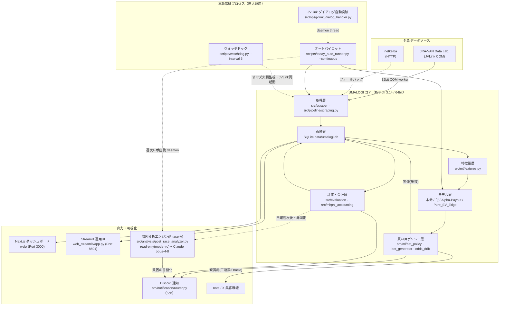
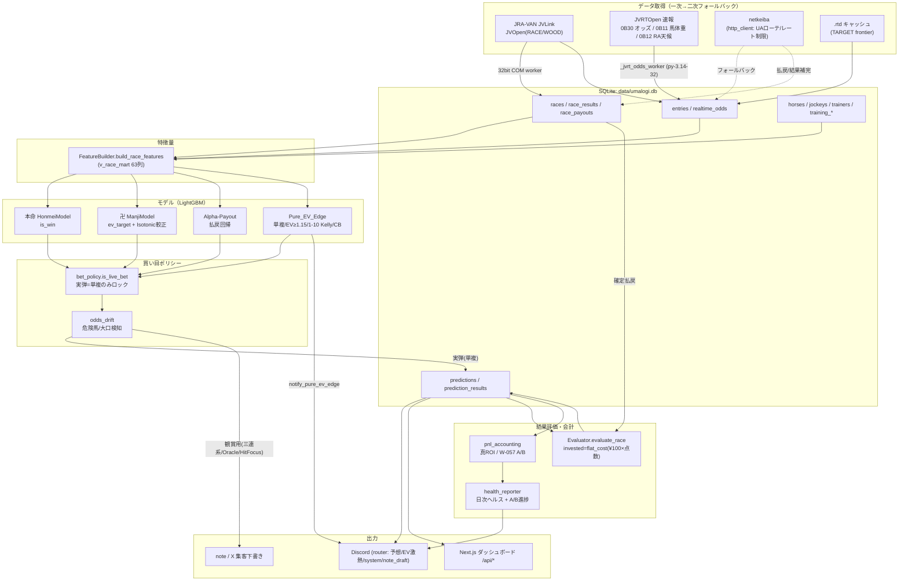
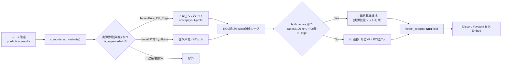
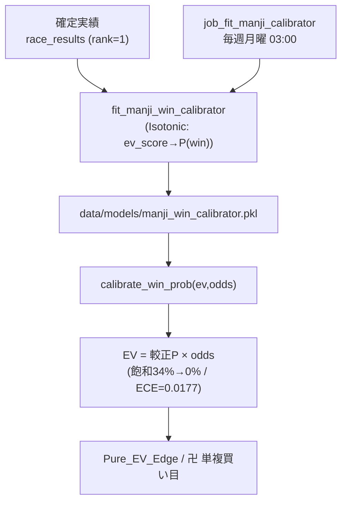

# UMALOGI システムアーキテクチャ仕様書 — v1.0.0

| 項目 | 値 |
|------|----|
| **仕様バージョン** | `1.0.0` |
| **対応プロダクトバージョン** | [`VERSION`](../../VERSION) = `1.0.0` |
| **策定日** | 2026-06-01 |
| **ステータス** | ✅ 現行（Active） |
| **正典区分** | 本書は `docs/spec/` 配下のバージョン固定仕様書である。最新の稼働実態は本書と [`docs/SYSTEM_ARCHITECTURE.md`](../SYSTEM_ARCHITECTURE.md) を正とする。 |

> **本書の位置づけ**
> 本書はリリース `v1.0.0` 時点のシステム全体設計を凍結したスナップショットである。
> コードの変更によりアーキテクチャが変わった場合は、[仕様書追従ポリシー](../../CLAUDE.md)に従い、
> セマンティックバージョニングのルール（後述）に基づいて本ファイルを更新するか、
> 後継バージョン（例: `ARCHITECTURE_v1.1.0.md`）を新設すること。

---

## 更新履歴（本仕様書）

| 仕様Ver | 日付 | 変更内容 |
|---------|------|----------|
| 1.14.1-dev | 2026-06-12 | **ログオン時自動復旧スタックへ Next.js Web UI(3000) を追加＋ランチャーbat完全ASCII化（W-085）**。運用層のみの変更: ①`scripts/bat/start_umalogi.bat`（正本）の常駐スタックを 3→4 プロセス化（4番目に Next.js Web UI・ポート3000 LISTEN 判定の二重起動ガード付き）。②UTF-8 日本語入り bat が新規コンソール(初期CP932)で cmd.exe に誤パースされ自動復旧が無言停止していた恒常障害を、ランチャー4バッチの 100% ASCII 化で根治（W-085 ルールとして README_BAT.md / CLAUDE.md に明文化）。③ルート `start_umalogi.bat` を scheduler.py 直接起動の残骸から正本への委譲シムに書換（排他則の経路防御）。④`stop_umalogi.bat` にポート3000の node 限定停止を追加。モデル・データフロー・DBスキーマ・実弾ポリシーは不変 |
| 1.14.0-dev | 2026-06-12 | **Web UI（ポート3000）プレミアムレポート統合＋文字化け絶対防御ロック**。①プレゼンテーション層: Next.js ダッシュボード（メイン監視環境）に新 API `GET /api/premium-report`（premium_sanren.html を charset=utf-8 配信・date 8桁検証）/`GET /api/premium-signals`（TypeScript 文字化けゲート付き JSON）と「💎 プレミアムレポート」ビュー（PremiumReportPanel・60秒自動追従・EV≥1.42 強調）を追加。データソースは `premium_pack.generate_premium_pack` が新規出力する `premium_signals.json`（outputs/marketing/YYYYMMDD/ 4ファイル目）— ファイルベース連携のため DB スキーマ不変。②防御層: `is_garbled()` に `?＋非ASCII` 繰り返し検知を追加し、`cleanup_encoding.py` を is_garbled_name 併用＋回復品質ゲートに強化（DB 全テーブル化け残留 618→0 件）。③運用層: `jvlink_dialog_handler._EXCLUDED_WIN_CLASSES` にターミナル系＋Delphi TApplication を追加（W-083 完了・TARGET frontier JV への IDOK 無限連打根治）。データフロー・実弾ポリシー・モデルは不変 |
| 1.13.0-dev | 2026-06-11 | **UI/UX 超絶強化（CUI Rich化/Discord プレミアムEmbed/HTML ラグジュアリーレポート）**。プレゼンテーション層を3面で刷新: ①UI 層に `src/ui/`（console.py=UmaConsole）を新設 — rich ベースの起動バナーPanel/グラデーションプログレスバー/高EVシグナルPanel/候補テーブル。rich 未導入・cp932・非TTY では plain 縮退（本番常駐の安全最優先）。`src/ops/logger.py setup_logging(use_rich=True)` で RichHandler コンソール装飾（既定 False・ファイルログ書式不変）。today_auto_runner・premium_pack に配線。②通知層に `src/notification/embed_builder.py` を新設 — 格付け推定（G1青/G2赤/G3緑=JRA配色）・自信度グラデーション・万馬券級EV優先の動的 Embed カラー、軸/相手/EV の inline 3カラムグリッド、`████░░░░░░ 40%` 投資比率バー（UMALOGI_BANKROLL 連動）。`notify_prerace_result` へ後方互換統合し prediction→router→notifier に race_name 貫通。③マーケティング層 `premium_pack` に `generate_premium_html` を追加 — Tailwind CDN＋明朝×ゴールドの自己完結 HTML（premium_sanren.html）を md と並列出力。依存に rich 追加。データフロー・実弾ポリシー・DBスキーマ・モデルは不変 |
| 1.12.0-dev | 2026-06-11 | **過去モデル昇華アンサンブル（卍EV回帰×三連複）**。ML層に `src/ml/legacy_ensemble.py` を新設: 全過去pkl資産のOOS静的解析（`scripts/analyze_legacy_models.py`）で唯一アンサンブル価値を持つと判定した卍(EV回帰・荒れレースAUC0.754・ρ(honmei)=0.33)の暗黙勝率を、`ensemble_win_probs`（総和保存・w=0恒等・失敗時フォールバック）で honmei 勝率に w=0.4 融合。適用は**三連複限定**（三連単はOOSで劣化のため従来確率を維持）。`premium_pack.scan_premium_races` が `ManjiScoreSource`（卍pkl直接ロード＋FeatureBuilder全頭推論）経由で使用し、週末オートパイロットのプレミアム生成から自動有効。OOS 400R: 合計ROI 110.0%→119.2%・三連複106.9%→157.9%。実弾ポリシー・DBスキーマ・モデルpklは不変 |
| 1.11.0-dev | 2026-06-11 | **収益化自動運用基盤＋W-078シミュレーション＋スクレイパー堅牢化（v1.11.0-dev）**。①マーケティング層にサブスク向け `src/marketing/premium_pack.py` を新設し、本番オートパイロット（`today_auto_runner._run_one_day`）へ best-effort 配線（週末朝に SNS集客5ファイルを outputs/marketing/ へ完全自動生成）。②`bankroll_manager` にポートフォリオ破産モンテカルロ（同一レース排反・対数複利）と P(破産)≤1% 制約の最適 Kelly 分数探索を追加（実弾未結線・OOSゲート維持）。③RTD TOCTOU / RTDファイル名検証 / netkeibaオッズAPI形状ガード / 日付正規化の堅牢化4パッチ。データフロー・実弾ポリシー・DBスキーマは不変 |
| 1.4.0-dev | 2026-06-01 | **W-002 PCI/RPCI 実装＋実バックフィル＋暫定重要度検証（v1.4.0-dev）**。`compute_race_pci`(RPCI=各馬PCI中央値)を追加し `ACCEL_FEATURE_COLS` を4列化(FEATURE_COLS_V2=73)。netkeibaバルクで last_3f を100R実充填＋`races.distance` 欠損(DB全体~0)を補填。暫定LightGBM(複勝圏gain%)で acceleration_score 51.4%/pci 21.7%/last_3f 14.6%/race_pci 12.4% を確認。JVLink 2024再取得は本環境COM未登録で不可(G-Tune PC専用)。**FEATURE_COLS(69)不変**。 |
| 1.3.0→1.4.0-dev | 2026-06-01 | **再学習準備フェーズ（v1.4.0-dev・本番 v1.2.0 凍結継続）**。過去データ整合性チェック(`check_jravan_integrity`・実測で2024後半の結果欠損を検出)、`last_3f` 冪等バックフィル(`bulk_backfill_features`・レート制限)、再シミュ骨子(`run_backtest_v2`＋`src/features/backtest_v2`・FEATURE_COLS を非破壊コピーして加速力3列を連結)を新設。いずれも開発用バッチで本番オートパイロット未結線・`FEATURE_COLS`(69列)不変。 |
| 1.2.0→1.3.0 | 2026-06-01 | **W-001 加速力スコア(上がり3F)＋PCI のデータ基盤（プロダクト v1.3.0・次期学習用）**。`race_results.last_3f`(additive)＋netkeiba列[11]抽出＋新規 `src/features/acceleration.py`（PCI西田式準拠・加速力z-score・並行計算）。**`FEATURE_COLS`(69列)は不変**で稼働中v1.2.0推論に非影響（ガードテストで担保）。再学習でFEATURE_COLSへ取り込むまで本番非結線。 |
| 1.1.1→1.2.0 | 2026-06-01 | **FukushoElite 本番統合（W-020・プロダクト v1.2.0）**。複勝特化モデルを実弾化（§1原則2の `LIVE_MODELS` に `FukushoElite` 追加＋`SELECTIVE_LIVE_MODELS` 新設＝W-064 監視の誤検知回避）。EV最優先2段ゲート（segment+edge → 統計的複勝EV≥1.05）で買い目生成し、`prediction._run_fukusho_elite()` を直前パイプラインに結線（§2/§7）。勝率/複勝率単独ベットを禁止し ROI95.4%→100%超を狙う。 |
| 1.1.0→1.1.1 | 2026-06-01 | **大穴 EV 暴騰の安全装置（W-066・プロダクト v1.1.1）**。卍 Isotonic 較正器が `odds` を考慮せず大穴の EV=P×odds が暴騰する歪みを推論時に是正（§6/§11）。①Layer1=`calibrate_win_prob` に市場相対キャップ `P ≤ EV_SANITY_CAP(2.0)/odds`（EV 頭打ち・卍単勝＋Pure_EV を一括保護・人気馬不変）。②Layer2=`pure_ev_edge` に実弾単勝の高オッズ足切り `MAX_LIVE_WIN_ODDS=50`。再学習不要。 |
| 1.0.0→1.1.0 | 2026-06-01 | **予防監視の追加（W-064/W-065・プロダクト v1.1.0）**。①`health_reporter`（§11/§8）に実弾モデル別(本命/卍/Alpha-Payout/Pure_EV_Edge)の直前予想生成件数(distinct race)集計を追加し、開催日に生成0件の実弾モデルがあれば日次ヘルスの severity を warn へ昇格＋Discord #system 通知＝Pure_EV_Edge=0 等の「サイレント障害」を毎開催日に自動検知。②`today_auto_runner`（§4）の金曜夜/土曜夜バッチに `x_scraper` 収集を subprocess 配線し、収集0件/失敗時は `x_consensus_score` を無言0埋めせず明示アラート（`X_SCRAPER_DISABLED=1` で無効化可）。 |
| 1.0.0 | 2026-06-01 | 初版策定。Pure_EV_Edge 完全配線 / W-057 シャドーA/B / W-058 日次ヘルスレポート / 卍 Isotonic 較正 / 単複限定ロック / 会計二重性分離 / コア層型安全化 を統合した稼働実態を凍結。本番常駐＝autopilot（`today_auto_runner.py --continuous`）＋ watchdog 構成を正式に明記。 |
| 1.0.0 | 2026-06-01 | **フェーズA: 自己診断・敗因分析エンジン**（`src/analysis/post_race_analyzer.py`）を初版に追加。EV≥1.0 不的中レースを read-only(mode=ro) で抽出 → Claude(`claude-opus-4-8` + adaptive thinking)で敗因を言語化 → Discord 投稿。オートパイロットの **日曜・週次レポート直後** に **非同期 daemon・best-effort** で起動（既存サイクルに非干渉）。全体図・モジュールマップ・ジョブ表に反映。 |

---

## 1. 概要

UMALOGI は JRA-VAN（JVLink）データを一次ソースとする自律型・競馬予測プラットフォームである。
LightGBM ベースの複数モデルが予測を出し、**実弾は単勝・複勝のみにロック**（確定実績分析に基づく）、
Pure_EV_Edge（黒字化専用枠）と従来モデルを **W-057 シャドーA/B** で常時比較しながら、
Discord 通知・Web ダッシュボード・note/X 集客導線へ出力する。

### 設計原則（不変条項）

| # | 原則 | 実装の単一真実源 |
|---|------|------------------|
| 1 | **一次/二次の二段構え** — JVLink（公式）→ netkeiba（フォールバック）。どちらが死んでも EV は算出される。 | `src/pipeline/scraping.py` |
| 2 | **実弾の単一真実源** — 実弾 = {本命, 卍, Alpha-Payout, Pure_EV_Edge} × {単勝, 複勝}。 | `src/ml/bet_policy.is_live_bet()` |
| 3 | **資金会計の厳密分離** — 実発注額（Kelly 等）と会計コスト（`flat_cost()`＝¥100×点数）を混同しない。 | `src/ml/bet_policy.flat_cost()` |
| 4 | **予測不変性（運用条項1）** — 過去 `predictions` は UPDATE/DELETE 禁止。再推論は新規 INSERT ＋ `is_superseded` 論理無効化。 | `predictions.is_superseded` |

---

## 2. システム全体図（コンポーネント俯瞰）

---

## 3. データフロー（JRA-VAN → DB → モデル → 投票/通知/UI）

---

## 4. 本番稼働アーキテクチャ（常駐プロセス）

> 本節は CLAUDE.md「本番稼働アーキテクチャ」ブロックと同期している。矛盾時は両者を突合のうえ修正すること。

| プロセス | 起動コマンド | 役割 |
|---|---|---|
| **オートパイロット** | `py scripts/today_auto_runner.py --continuous` | 週次自律運転の中核。金曜夜のデータ同期＋暫定予想 → 土日の直前予想/結果速報の監視ループ → 日曜の週次レポート → 翌週金曜まで自動スリープを、人手ゼロで回す。 |
| **ウォッチドッグ** | `py scripts/watchdog.py --interval 5` | 自己修復番犬。当日レースのオッズ欠損を監視し、検知時に JVLink 再起動＋データ再同期を段階的に実行。 |
| **ダッシュボード** | `py -m streamlit run web_streamlit/app.py --server.port 8501` | 成果可視化 Streamlit UI。**正本は `web_streamlit/app.py` 唯一**（`src/web/dashboard.py` は逆統合により廃止済）。 |
| **Next.js Web UI** | `web/` で `npm start`（= `next start -H 0.0.0.0 -p 3000`） | 的中実績・プレミアムレポート閲覧 UI（ポート3000）。2026-06-12 (W-085) からログオン時自動復旧スタック（`scripts/bat/start_umalogi.bat` の 4 プロセス目）に含まれる。 |

### ⚠️ `scheduler.py` の排他関係（誤認防止）

- `scripts/scheduler.py`（schedule ライブラリ方式）は **現在の本番では稼働していない**。
- `scheduler.py` と `today_auto_runner.py --continuous` は **同一の週次自動運転の排他的 2 実装**であり、
  **両方を同時に常駐させてはならない**（二重予想・二重 Discord 通知・`predictions` 汚染を招く）。
- ワンクリック起動・停止: `scripts/bat/start_umalogi.bat` / `scripts/bat/stop_umalogi.bat`。

---

## 5. W-057 シャドーA/B 検証ループ

確定 P&L（`flat_cost` 基準・`is_superseded` 除外）で「Pure_EV_Edge 適用」と
「従来単複（本命/卍/Alpha）非適用」を比較し、昇格基準（`AB_MIN_RACES=100` かつ
`AB_ROI_DIFF_THRESHOLD=+10.0pt`）への進捗を日次ヘルスレポートへ自動出力する。

---

## 6. 卍 Isotonic 較正（W-048 解消）と週次自動再学習

---

## 7. モジュールマップ（主要）

| レイヤ | モジュール | 役割 |
|---|---|---|
| 取得 | `src/scraper/jravan_client.py` | JVLink COM（JVOpen/JVRTOpen/JVRead・32bit） |
| 取得 | `scripts/_jvrt_odds_worker.py` | 速報オッズ/馬体重/天候の 32bit ワーカー |
| 取得 | `src/scraper/http_client.py` / `netkeiba.py` / `entry_table.py` | netkeiba 二次ソース（UAローテ/レート制限） |
| 取得 | `src/scraper/rtd_reader.py` | `.rtd`/速報 O1/WH パース・`build_rt_race_key` |
| 特徴 | `src/ml/features.py` | FeatureBuilder（v_race_mart） |
| モデル | `src/ml/models.py` / `models_v2.py` / `alpha_payout_model.py` | 本命/卍/Alpha（V1/V2） |
| モデル | `src/ml/pure_ev_edge.py` | Pure_EV_Edge（単複/EV≥1.15/1-10 Kelly/CB） |
| モデル | `src/ml/manji_calibration.py` | 卍 Isotonic 較正 |
| ポリシー | `src/ml/bet_policy.py` | 実弾単一真実源 `is_live_bet` / `flat_cost` |
| ポリシー | `src/ml/bet_generator.py` | 買い目生成・`_apply_roi_filter`（単複ロック） |
| ポリシー | `src/ml/odds_drift.py` | 危険馬/大口オッズ歪み検知 |
| パイプライン | `src/pipeline/prediction.py` | `prerace_pipeline`（推論→保存→通知） |
| パイプライン | `src/pipeline/scraping.py` | `fetch_and_save_odds`（Stage0 JRA-VAN速報→RTD→netkeiba→DB） |
| 評価/会計 | `src/evaluation/evaluator.py` | 的中評価（同着/返還対応・invested=flat_cost） |
| 評価/会計 | `src/ml/pnl_accounting.py` | 真ROI / W-057 A/B |
| 自己診断 | `src/analysis/post_race_analyzer.py` | 敗因分析(Phase-A): EV≥1.0不的中抽出→Claude opus-4-8言語化→Discord（read-only/client・notifier注入式） |
| 運用 | `src/ops/health_reporter.py` | 日次ヘルス + A/B進捗 |
| 運用 | `src/ops/retrain_trigger.py` | 週次全件再学習（土日ガード） |
| 通知 | `src/notification/router.py` | マルチWebhook（予想/EV激熱/system/note_draft） |
| 自動化 | `scripts/today_auto_runner.py` | 【本番常駐】当日全レース直前予想ループ（--continuous） |
| 自動化 | `scripts/watchdog.py` | 【本番常駐】自己修復番犬（オッズ欠損監視） |
| 自動化 | `scripts/scheduler.py` | 週次スケジューラ（排他代替・現在不使用） |

---

## 8. 主要スケジューラジョブ（オートパイロット内部サイクル）

| ジョブ | 時刻 | 内容 |
|---|---|---|
| `job_fit_manji_calibrator` | 月 03:00 | 卍較正器の週次再学習（W-057関連） |
| `job_weekly_retrain` | 月 07:00 | 全件再学習（土日ガード・別スレッド） |
| `job_today_auto_runner` | 土日 08:30 | 当日全レース直前予想ループ起動 |
| `job_post_race` | 土日 17:30 | 結果取得＋評価＋通知（retrain=False） |
| `job_health_report` | 土日 17:50 | 日次ヘルス + W-057 A/B進捗 → Discord |
| 敗因分析(Phase-A) | 日曜 週次レポート直後 | `_kick_post_race_analysis` が EV≥1.0 不的中を Claude で敗因言語化→Discord（**非同期 daemon・best-effort**・例外内包） |

---

## 9. 会計の二重性（厳密分離）

| 概念 | 変数/関数 | 用途 |
|---|---|---|
| 実発注額 | `predictions.recommended_bet` | 実際に賭ける額（Kelly / 1-10 Kelly 実額） |
| 会計コスト | `bet_policy.flat_cost(点数)` = ¥100×点数 | P&L・ROI・A/B 評価（stake非依存） |
| 真ROI | `pnl_accounting`: SUM(payout) / SUM(payout−profit) | 実弾(is_live)のみ・`is_superseded` 除外 |

`evaluator.invested = flat_cost(n_tickets)` で会計を一本化し、`recommended_bet`(実発注額)は
ROI 計算に一切使わない。これにより Kelly 実額と評価基準が混同されない。

---

## 10. パフォーマンス（複合インデックス）

| インデックス | 対象 | 効果 |
|---|---|---|
| `idx_pred_ab` | predictions(is_superseded, created_at, model_type, bet_type) | A/B・真ROIの WHERE+GROUP |
| `idx_pred_r_cover` | prediction_results(prediction_id, payout, profit, is_hit) | JOIN+集計をカバリングインデックス化 |
| `idx_odds_race_horse_rec` | realtime_odds(race_id, horse_number, recorded_at DESC) | 最新オッズ/馬体重スナップショット取得 |

> **ANALYZE による統計駆動の index 選択**: マイグレーション後に `ANALYZE`（非破壊・冪等）を
> 実行することで、プランナが COVERING INDEX を選択しテーブルアクセスがゼロ化する
> （EXPLAIN QUERY PLAN で実証済み）。

---

## 11. 品質・テスト

- 静的解析: `ruff check` クリーン（`ruff.toml` production-sane ルール）。
- 型安全: `mypy`（`mypy.ini`・`check_untyped_defs`）。リポジトリ全体で型エラーゼロを達成。
  `from __future__ import annotations` ＋ `TYPE_CHECKING` ブロックで循環 import を避けつつ型注釈を付与。
- テスト: `pytest`（1000+ ケース。異常系・境界値・サーキットブレーカー・DBロック・ネット断・
  型契約回帰（`tests/test_typesafety_contracts.py`）を含む）。`conftest.py` でテストを完全独立化
  （空DB / `.env` 注入 / `journal_mode=DELETE`）。
- 較正検証: 時系列 out-of-sample で ECE=0.0177（予測P≒実勝率）。

---

## 12. セマンティックバージョニング規約（本仕様書の改訂ルール）

本プロジェクトは [Semantic Versioning 2.0.0](https://semver.org/lang/ja/) に準拠する。
`MAJOR.MINOR.PATCH` の各桁は以下の変更で繰り上げる。

| 桁 | 繰り上げ条件 | 仕様書の扱い |
|----|--------------|--------------|
| **MAJOR** | 後方互換性を破る変更（DBスキーマ破壊的変更・実弾ポリシーの根本変更・モデル目的変数の変更） | 新ファイル `ARCHITECTURE_v2.0.0.md` を新設し、本書を「過去版」として保持 |
| **MINOR** | 後方互換な機能追加（新モデル追加・新特徴量・新通知チャネル） | 新ファイル `ARCHITECTURE_v1.1.0.md` を新設、または本書を改訂し更新履歴へ追記 |
| **PATCH** | バグ修正・リファクタ・ドキュメント修正（挙動互換） | 本書の更新履歴へ追記 |

詳細な運用フロー（VERSION 更新・MAINTENANCE_LOG 記述・コミット必須条件）は
[`CLAUDE.md`](../../CLAUDE.md) の「バージョン運用フロー」および「仕様書追従ポリシー」を参照。
